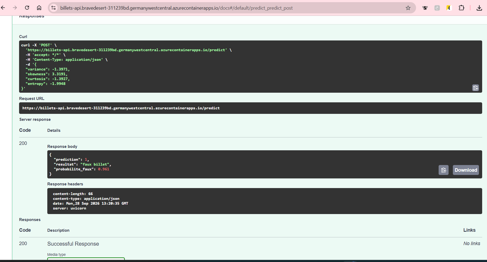
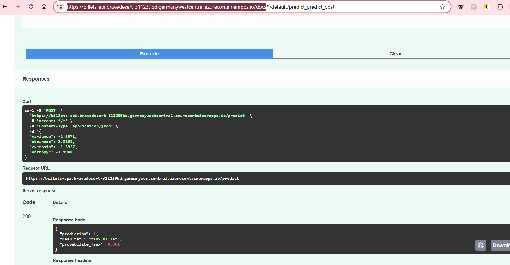

# API de détection de faux billets (Scikit-learn, FastAPI, Docker, Azure)

Ce projet est un exercice de déploiement que j'ai réalisé pour apprendre à sortir un modèle de machine learning d'un notebook et le rendre utilisable par d'autres.

L'idée était d'entraîner un modèle simple, de l'exposer via une API, de le mettre dans un conteneur Docker, puis de le déployer sur Azure.

## Le modèle

On envoie à l'API les 4 caractéristiques d'un billet de banque, et elle répond si le billet est vrai ou faux, avec une probabilité.

Données : [Banknote Authentication](https://archive.ics.uci.edu/dataset/267/banknote+authentication) (UCI), 1 372 billets décrits par 4 variables.

Modèle : régression logistique précédée d'une normalisation, dans un Pipeline scikit-learn. La normalisation est sauvegardée avec le modèle, donc l'API n'oublie aucune étape du prétraitement (97 % d'accuracy).

## Les fichiers

- `train.py` : entraîne le modèle et le sauvegarde dans `model/model.joblib`
- `app/main.py` : contient l'API FastAPI, avec un endpoint `/predict`
- `requirements.txt` : les bibliothèques nécessaires, avec leurs versions exactes, pour que le modèle puisse être utilisé sans problème sur n'importe quel autre ordinateur
- `Dockerfile` : les instructions pour construire l'image Docker

## Lancer le projet en local

```powershell
python -m venv .venv
.venv\Scripts\Activate.ps1
pip install -r requirements.txt ucimlrepo
python train.py
uvicorn app.main:app --reload
```

## Avec Docker

```powershell
docker build -t billets-api .
docker run -p 8000:8000 billets-api
```

L'API est disponible sur http://127.0.0.1:8000/docs.

## Exemple d'appel

On envoie les 4 caractéristiques d'un billet en JSON sur `/predict` :

```json
{
  "variance": -1.3971,
  "skewness": 3.3191,
  "curtosis": -1.3927,
  "entropy": -1.9948
}
```

et l'API répond :

```json
{
  "prediction": 1,
  "resultat": "faux billet",
  "probabilite_faux": 0.961
}
```

## Déploiement sur Azure

L'image Docker est envoyée dans un Azure Container Registry, puis lancée avec Azure Container Apps, qui donne une adresse publique à l'API.

L'API n'est plus en ligne, mais voici ce que ça donnait :




